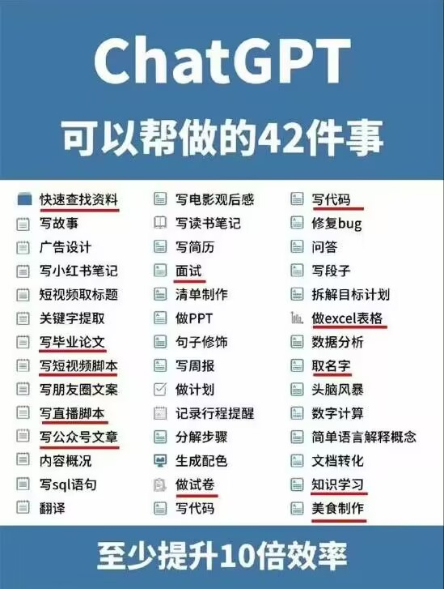
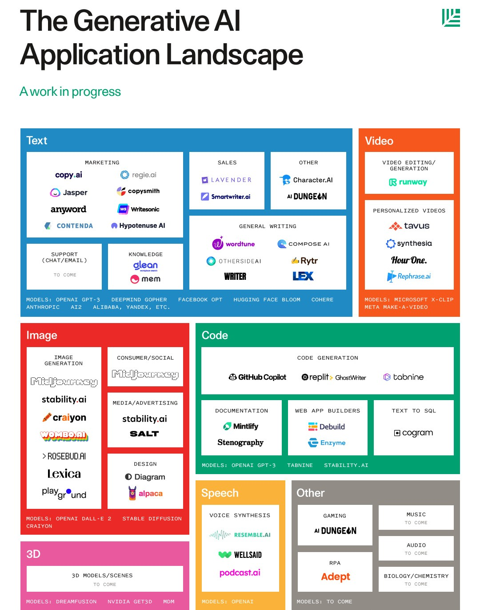

# AI 工具和用法汇总

汇集整理 by [Staok/瞰百](https://github.com/Staok)，源于相关资料在我这慢慢越积累越多，到了不得不梳理的程度。文中出现的网图侵删。

文中有许多内容作者还没有亲自尝试，所以很多内容只是罗列，但信息大源都已给出，授人以渔，欢迎 PR 补充细节内容，比如 好的教程、简明使用步骤、工具的优缺点、使用经验等等！！！

注：[这是 本文原版文章的 Github 仓库，在这里日后可能会更新](https://github.com/Staok/Awesome-AI-Tools)，在其它位置发的不会跟进，原文使用 Markdown 写成，在一些网站的排版会不完美，推荐去 github/gitee 或者 [个人小站](https://staok.gitee.io/28ai%E5%B7%A5%E5%85%B7%E5%92%8C%E7%94%A8%E6%B3%95%E6%B1%87%E6%80%BB/) 看原文，[这是文章的 Gitee 仓库地址，Gitee 访问更流畅](https://gitee.com/staok/Awesome-AI-Tools)。

*带着AI看这大千世界*

富强、**民主**、文明、和谐，**自由**、平等、公正、法治，爱国、敬业、诚信、友善。

------

## ！Awesome AI Tools 相关仓库！

Github 上面直接搜：[Repository search results · GitHub](https://github.com/search?q=Awesome+AI+Tools&type=repositories&s=&o=desc)。

- [ikaijua/Awesome-AITools: Collection of AI-related utilities. Welcome to submit issues and pull requests /收藏AI相关的实用工具，欢迎提交issues 或者pull requests (github.com)](https://github.com/ikaijua/Awesome-AITools)。
- [jiji262/awesome-AIGC-tools: AIGC information including ChatGPT , GPT-4 and others. (github.com)](https://github.com/jiji262/awesome-AIGC-tools)。
- [pingan8787/awesome-ai-tools: Finding the AI tools you need! (github.com)](https://github.com/pingan8787/awesome-ai-tools)。
- [JMcrafter26/awesome-ai-tools: A list of AWESOME AI tools on Github](https://github.com/JMcrafter26/awesome-ai-tools)。
- [nanogiants/awesome-ai-tools: A curated list of AI-powered tools (github.com)](https://github.com/nanogiants/awesome-ai-tools)。
- [georgezouq/awesome-ai-in-finance: 🔬 A curated list of awesome machine learning strategies & tools in financial market. (github.com)](https://github.com/georgezouq/awesome-ai-in-finance)。
- [altryne/awesome-ai-art-image-synthesis: A list of awesome tools, ideas, prompt engineering tools, colabs, models, and helpers for the prompt designer playing with aiArt and image synthesis. Covers Dalle2, MidJourney, StableDiffusion, and open source tools. (github.com)](https://github.com/altryne/awesome-ai-art-image-synthesis)。
- [CognonicLabs/awesome-AI-kubernetes: Awesome tools and libs for AI, Deep Learning, Machine Learning, Computer Vision, Data Science, Data Analytics and Cognitive Computing that are baked in the oven to be Native on Kubernetes and Docker with Python, R, Scala, Java, C#, Go, Julia, C++ etc (github.com)](https://github.com/CognonicLabs/awesome-AI-kubernetes)。

## AIGC 相关

AIGC 词义，百度百科 be line [AIGC_百度百科 (baidu.com)](https://baike.baidu.com/item/AIGC/59988381?fr=aladdin)，维基百科 be like [Generative artificial intelligence - Wikipedia](https://en.wikipedia.org/wiki/Generative_artificial_intelligence)，还有 [AIGC - MBA智库百科 (mbalib.com)](https://wiki.mbalib.com/wiki/AIGC)，[人工智能生成内容（AIGC）白皮书（2022年）--中国信通院 (caict.ac.cn)](http://www.caict.ac.cn/sytj/202209/t20220913_408835.htm) 可直接下载 pdf。

### ChatGPT 快速使用

- [ChatGPT国内镜像网站整理 - 哔哩哔哩 (bilibili.com)](https://www.bilibili.com/read/cv24172963/)。

- [Chat8永久地址 地址发布页 (chat88.co)](https://chat88.co/)，本文作者目前只用过这个，蛮好，注册用户免费 提问 1000 次（日常使用够了）。
- [chating AI-智能AI领导者 (yiweiss.com)](https://chating.yiweiss.com/)。
- [首页 - Deeppp新一代AI技术驱动Bot平台,自定义Bot,自训练Bot](https://www.deeppp.com/)。
- [道合顺infinigo官网-国产芯片替代,IC交易网上商城,电子元器件智能匹配平台](https://www.infinigo.com/chatic) 适合搞硬件的用。

一个 综合贴 [GPT-4与GPT-3.5免费AI平台大全_-资本家-的博客-CSDN博客](https://blog.csdn.net/weixin_44406127/article/details/130485973)。

### GPT 相关介绍 / 感悟文章 / 相关话题

综合性，持续更新的：

- [差评君的个人空间 - AI大模型实测_ 哔哩哔哩_bilibili](https://space.bilibili.com/19319172/channel/collectiondetail?sid=1282107)。
- GitHubDaily 的 [#ChatGPT (qq.com)](https://mp.weixin.qq.com/mp/appmsgalbum?__biz=MzAxOTcxNTIwNQ==&action=getalbum&album_id=2699685581743882241&scene=173&from_msgid=2457979558&from_itemidx=1&count=3&nolastread=1#wechat_redirect) 列表，持续更新。
- 知乎相关话题：[ChatGPT - 知乎 (zhihu.com)](https://www.zhihu.com/topic/26691895/top-answers)。[ChatGPT变现 - 知乎 (zhihu.com)](https://www.zhihu.com/topic/26988602/hot)。[ChatGPT概念 - 知乎 (zhihu.com)](https://www.zhihu.com/topic/26983774/top-answers)。

相关话题文章：

- [ChatGPT的工作原理 (qq.com)](https://mp.weixin.qq.com/s?__biz=MzA3NTAxMjEyMg==&mid=2649956389&idx=1&sn=044667416a3be7dfefd055955dacdda1&chksm=87708150b0070846e679b7864a7a8f666eddce8c32f28fd196c49aac32bbba2bb31b41e23f7c&scene=132#wechat_redirect)。
- [冒冷汗.... GPT-5 已经看完了人类世界所有视频 (qq.com)](https://mp.weixin.qq.com/s?__biz=Mzg3NjY4NDQxMw==&mid=2247483915&idx=1&sn=296135e3e798eb49c01e940a043f3427&chksm=cf2f3719f858be0f949d3897b74d7736c24a8918d0f82b0f01a862beb26897054648679fbac6&scene=132#wechat_redirect)。
- [ChatGPT是传说中的银弹吗？ (qq.com)](https://mp.weixin.qq.com/s?__biz=MzI4NjY1NjAxMQ==&mid=2247484241&idx=1&sn=d281123c6e04f9242d9e514c8ba87795&chksm=ebd8d035dcaf59235aa6b6a2986842faeeb099ed13a04144bcf4f65470a06eadefd88a9d7d46&scene=178&cur_album_id=2853007418614661128#rd)。

- [「AI 孙燕姿」火遍全网，随着技术的发展，未来 AI 歌手会成为主流吗？这一技术还可能应用到哪些场景？ - 知乎 (zhihu.com)](https://www.zhihu.com/question/599898172)。
- [AI 孙燕姿爆火、美国女网红出售 AI 女友爆赚、AI 券商分析师也来了，AI 还将改变哪些行业？ - 知乎 (zhihu.com)](https://www.zhihu.com/question/600653363)。

### GPT 综合性合集

综合性 GPT 教程：

- [🧭 ChatGPT 学习导航 | Learning Prompt](https://learningprompt.wiki/docs/chatgpt-learning-path)。
- [‍‍⁢⁢‌⁤‍‌⁣⁢‌‌‌⁣⁣‌⁣⁢‌⁤‍⁤⁣‌‍⁢‬‍‍最全 ChatGPT 使用手册 - 飞书云文档 (feishu.cn)](https://eibot3u32o.feishu.cn/docx/E7jodtO4fosu4SxdgCrcWF1Znvd)，翻译自外网。

综合贴：

- [LangLangShanDeNanKe/chatgpt: ChatGPT网址导航，分享免费好用AI网站！ (github.com)](https://github.com/LangLangShanDeNanKe/chatgpt)。
- [📚 资料 & 产品推荐 | Learning Prompt](https://learningprompt.wiki/docs/category/-资料--产品推荐)。

### ChatGPT做事情景列举

### GPT 接口调用 / 本地部署 优秀例子

- [mic1on/chatGPT-web: chatGPT私有化部署 (github.com)](https://github.com/mic1on/chatGPT-web)。
- [SkywalkerDarren/chatWeb: ChatWeb can crawl web pages, read PDF, DOCX, TXT, and extract the main content, then answer your questions based on the content, or summarize the key points. (github.com)](https://github.com/SkywalkerDarren/chatWeb)。
- [Yidadaa/ChatGPT-Next-Web: One-Click to deploy well-designed ChatGPT web UI on Vercel. 一键拥有你自己的 ChatGPT 网页服务。 (github.com)](https://github.com/Yidadaa/ChatGPT-Next-Web)。
- [pengzhile/pandora: 潘多拉，一个让你呼吸顺畅的ChatGPT。Pandora, a ChatGPT that helps you breathe smoothly. (github.com)](https://github.com/pengzhile/pandora)。
- [lss233/chatgpt-mirai-qq-bot: 🚀 一键部署！真正的 AI 聊天机器人！支持ChatGPT、文心一言、Bing、Bard、ChatGLM、POE，多账号，人设调教，虚拟女仆、图片渲染、语音发送 | 支持 QQ、Telegram、Discord、微信 等平台 (github.com)](https://github.com/lss233/chatgpt-mirai-qq-bot)。
- [202252197/ChatGPT_JCM: OpenAI管理界面，聚合了OpenAI的所有接口进行界面操作(所有模型、图片、音频、微调、文件)等，支持Markdown格式(公式、图表，表格)等，GPT4接口官方只是在申请阶段，后期会一点一点的将OpenAI接口进行接入大家支持一下，微信群号在下方，右上角点个Star，我会一直更新下去，大家一起学习，一起加油，一起努力，一起成长。 (github.com)](https://github.com/202252197/ChatGPT_JCM)。
- [ztjhz/BetterChatGPT: An amazing UI for OpenAI's ChatGPT (Website + Windows + MacOS + Linux) (github.com)](https://github.com/ztjhz/BetterChatGPT)。

### 类ChatGPT快速本地部署

- [本地部署类chatGPT私有化CPU流畅运行130亿参数大语言模型AVX512指令集加速vicuna_哔哩哔哩_bilibili](https://www.bilibili.com/video/BV1eM4y1Y7ET/?vd_source=c633af9518bed5572b1614612e2be3df)。

### GPT 插件 / /妙用

- [xcanwin/KeepChatGPT: 这是一个ChatGPT的畅聊与增强插件。开源免费。不仅能解决所有报错不再刷新，还有保持活跃、取消审计、克隆对话、净化首页、展示大屏、展示全屏、言无不尽、拦截跟踪、日新月异等多个高级功能。让我们的AI体验无比顺畅、丝滑、高效、简洁。 (github.com)](https://github.com/xcanwin/KeepChatGPT)。

- [ChatGPT 有什么新奇的使用方式？ - 知乎 (zhihu.com)](https://www.zhihu.com/question/582979328/answer/3005839274)。

## 提示词工程

> 引自 [吴恩达给五一假期贡献了Prompt教程 (qq.com)](https://mp.weixin.qq.com/s?__biz=Mzg4Nzg5NzUxNg==&mid=2247483908&idx=1&sn=228f22f78c2b31179d224458cafe0b33&chksm=cf822ec7f8f5a7d1c6c9c46fb64f43144cda2da09e3727074a6e48d08411b635f40f9278e10d&scene=132#wechat_redirect)。
>
> 熟练掌握 Prompt 编写的人，能够很快让 ChatGPT 理解需求，并很好的执行任务。只要你的 Prompt 写的足够好，ChatGPT 可以帮你快速完成很多工作，包括写爬虫脚本、金融数据分析、文案润色与翻译等等，并且这些工作还做的比一般人出色。

在上面 `GPT 综合性合集` 一节里面 也列举了一些 提示词 教程。

[提示工程 - 维基百科，自由的百科全书 (wikipedia.org)](https://zh.wikipedia.org/wiki/提示工程)。

### ChatGPT-Shortcut

> 该项目整理并汇总了多种让生产力加倍的 ChatGPT 快捷指令，按照领域和功能分区，可对提示词（Prompt）进行标签筛选、关键词搜索和一键复制。

- 相关文章：[5 个令人惊艳的 ChatGPT 项目，开源了！ (qq.com)](https://mp.weixin.qq.com/s?__biz=MzAxOTcxNTIwNQ==&mid=2457981046&idx=1&sn=56bdf532714e5f49c6497c6a81c07823&chksm=8cb7b59cbbc03c8a612ecb8aa264b34a65c84aaa0c2a287fd568d775c5741f341232d1091210&scene=178&cur_album_id=2699685581743882241#rd)。
- Github 仓库：[rockbenben/ChatGPT-Shortcut: Maximize your efficiency and productivity. 让生产力加倍的 ChatGPT 快捷指令，按照领域和功能分区，可对提示词进行标签筛选、关键词搜索和一键复制。 (github.com)](https://github.com/rockbenben/ChatGPT-Shortcut)。
- 即用网页：[ChatGPT Shortcut - 简单易用的 ChatGPT 快捷指令表，让生产力倍增！标签筛选、关键词搜索和一键复制 Prompts | Tag filtering, keyword search, and one-click copy prompts (aishort.top)](https://www.aishort.top/?tags=code)。

### awesome-chatgpt-prompts

- Github 仓库：[f/awesome-chatgpt-prompts: This repo includes ChatGPT prompt curation to use ChatGPT better. (github.com)](https://github.com/f/awesome-chatgpt-prompts)。
- 网页：[Awesome ChatGPT Prompts | This repo includes ChatGPT prompt curation to use ChatGPT better.](https://prompts.chat/)。
- 一个对 这个 仓库的 中文梳理：[ChatGPT | LearnData-开源笔记 (newzone.top)](https://newzone.top/apps/ChatGPT.html#导览)。

### awesome-chatgpt-prompts-zh

- Github 仓库：[PlexPt/awesome-chatgpt-prompts-zh: ChatGPT 中文调教指南。各种场景使用指南。学习怎么让它听你的话。 (github.com)](https://github.com/PlexPt/awesome-chatgpt-prompts-zh#正经指南)。

### img-prompt - 图像生成提示词

> 极简的图像提示词编辑器，专注于提示词文本组合，可用于Stable Diffusion和Midjourney。

- Github 仓库：[rockbenben/img-prompt: 极简的图像提示词编辑器，专注于提示词文本组合，可用于Stable Diffusion和Midjourney。 (github.com)](https://github.com/rockbenben/img-prompt)。
- 即用网页：[IMGPrompt (newzone.top)](https://prompt.newzone.top/)。

### 《Prompt 编写模式》开源书

- Github 仓库：[prompt-engineering/prompt-patterns: Prompt 编写模式：如何将思维框架赋予机器，以设计模式的形式来思考 prompt (github.com)](https://github.com/prompt-engineering/prompt-patterns)。
- 即用网页，书直接看：[Prompt 编写模式：如何将思维框架赋予机器 | prompt-patterns (phodal.com)](https://prompt-patterns.phodal.com/)。

更多内容 [Prompt Engineering（瑞书工程） (github.com)](https://github.com/prompt-engineering)。

### 《ChatGPT Prompt Engineering for Developers》开源课

- 引言笔记 [吴恩达ChatGPT Prompt Engineering for Developers课程学习笔记 (qq.com)](https://mp.weixin.qq.com/s/o6wNZ2JZRNZNbqXxVy2RHQ)。
- 一些笔记 [吴恩达老师ChatGPT提示工程课程笔记 (qq.com)](https://mp.weixin.qq.com/s?__biz=MzI4NjY1NjAxMQ==&mid=2247484285&idx=1&sn=05634502d4fe4ca9846562ea1ede0e44&chksm=ebd8d019dcaf590f1f97847b9c1f7157491480ec0674f95486bf4207089e3197ea74c0db44c9&scene=132#wechat_redirect)。
- 原版视频，哔哩哔哩 可直接看 [GitHubDaily的个人空间 - ChatGPT提示 _ 哔哩哔哩 _ bilibili](https://space.bilibili.com/15467823/channel/seriesdetail?sid=3247315)。

### OpenAI 官网教程

https://platform.openai.com/docs/guides/completion。

### GPT 生成网文

- [ChatGPT最实用的提示（Prompts）写法有哪些？ - 知乎 (zhihu.com)](https://www.zhihu.com/question/584402332/answer/2979461989)。

### GPT 充当角色

- [chatgpt的150个指令大全_cxscode的博客-CSDN博客](https://blog.csdn.net/cxs812760493/article/details/130544858)。

## AI 相关工具集

### 合集

- [AI工具-哔哩哔哩_Bilibili](https://search.bilibili.com/all?keyword=AI工具)，[AIGC工具-哔哩哔哩_Bilibili](https://search.bilibili.com/all?keyword=AIGC工具)。
- [在我忘记之前 - 知乎 (zhihu.com)](https://www.zhihu.com/column/glenji)。
- [产品君的个人空间-AI生产力系列_ 哔哩哔哩 _bilibili](https://space.bilibili.com/1845434732/channel/collectiondetail?sid=1237152&ctype=0)。
- [AIChannel官方的个人空间_ 哔哩哔哩 _bilibili](https://space.bilibili.com/1473830)，[AIChannel中国绊爱的个人空间_ 哔哩哔哩 _bilibili](https://space.bilibili.com/484322035)。~~误~~

### AI工具箱软件

- [Baiyuetribe/paper2gui: Convert AI papers to GUI，Make it easy and convenient for everyone to use artificial intelligence technology。让每个人都简单方便的使用前沿人工智能技术 (github.com)](https://github.com/Baiyuetribe/paper2gui)。
- [AI工具箱来啦，AI绘画、VITS文本转语音，唇型同步，视频修复_哔哩哔哩_bilibili](https://www.bilibili.com/video/BV19s4y1w7iK/)。
- .etc

### 图灵测试

这里是放 AI 聊天 相关的工具软件、经验用法等。

- [Character.AI 首周下载量碾压 ChatGPT，这一应用有哪些特点？将会带来哪些影响？ - 知乎 (zhihu.com)](https://www.zhihu.com/question/604552431/answer/3057540163)。

  > Character.AI 由谷歌 LaMDA 的前开发人员 Noam Shazeer 和 Daniel De Freitas 开发，最早的测试版于 2022 年 9 月开放。
  > 在 Character.AI 中，用户可以创建「角色」，塑造他们的「个性」，设置特定参数，然后发布到社区供其他人聊天。这些角色可以基于虚构的名人，也可以是完全是原创的；这些角色可以为了特定的目标而制作——例如协助创意写作或成为基于文本的冒险游戏。
  > 在交互形态上，用户既可以与单个角色联系，也可以组织包含多个角色的群聊；同时，这些角色也可以与单个/多个用户交谈。

  > ChatGPT 并不是万能的，你要像对待一个「**知识全能而经验全无的员工**」一样对待他。**他并不知道你的工作背景、实际需求，你千万不要直接扔给他一个标题就完事，否则大概率得不到什么太好的结果。**你可以像给实习生布置工作一样，**告诉他背景，告诉他提纲，告诉他要点，甚至给他几个示例，然后，相信他会给出你更完美的答案。**
  >
  > 
  >
  > 基于大语言模型能力和情感陪伴需求，不难想象出角色扮演类产品的工作流其实是这样的：**找到一个固定的 prompt 或技术手段，喂给 AI 故事背景，洗脑 AI 来扮演一个特定的角色。既可以预设一些批量生成的故事，也可以由用户来自定义生成。**

- .etc

### AI 全链路 / 助理类

#### AutoGPT - AI 全链路

- 相关文章：
  - [近期最火的GPT神器：AutoGPT，你知道多少 (baidu.com)](https://baijiahao.baidu.com/s?id=1763141741502922059&wfr=spider&for=pc)。
  - [AutoGPT怎么使用 AutoGPT使用教程一览 - QT软件园 (qtvcd.com)](https://www.qtvcd.com/news/739-153851.html)。

- Github 仓库：

  - [Significant-Gravitas/Auto-GPT: An experimental open-source attempt to make GPT-4 fully autonomous. (github.com)](https://github.com/Significant-Gravitas/Auto-GPT)。

  - [RealHossie/Auto-GPT-Chinese: AutoGPT真中文版 (github.com)](https://github.com/RealHossie/Auto-GPT-Chinese)。

- 部署相关：
  - [Dogtiti/AutoGPT-Next-Web: 🤖 Assemble, configure, and deploy autonomous AI Agents in your browser.一键免费部署你的私人AutoGPT 网页应用 (github.com)](https://github.com/Dogtiti/AutoGPT-Next-Web)。
  - [thecookingsenpai/autogpt-gui: A graphical user interface for AutoGPT (github.com)](https://github.com/thecookingsenpai/autogpt-gui)。

#### AgentGPT

- 相关文章：[AI杀疯了 | 自动帮你分解任务AgentGPT - 知乎 (zhihu.com)](https://zhuanlan.zhihu.com/p/627853932)。
- 

### 开发相关 / GPT 衍生工具

#### 学术优化

**binary-husky/gpt_academic**

> 为GPT/GLM提供图形交互界面，特别优化论文阅读润色体验，模块化设计支持自定义快捷按钮&函数插件，支持代码块表格显示，Tex公式双显示，新增Python和C++项目剖析&自译解功能，PDF/LaTex论文翻译&总结功能，支持并行问询多种LLM模型，支持清华chatglm等本地模型。
>
> | 功能                      | 描述                                          |
> | :------------------------ | :-------------------------------------------- |
> | 一键润色                  | 支持一键润色、一键查找论文语法错误            |
> | 一键中英互译              | 一键中英互译                                  |
> | 一键代码解释              | 可以正确显示代码、解释代码                    |
> | 自定义快捷键              | 支持自定义快捷键                              |
> | 配詈代理服务器            | 支持配置代理服务器                            |
> | 模块化设计                | 支持自定义高阶的实验性功能                    |
> | 自我程序剖析              | ［实验性功能］ 一键读懂本项目的源代码         |
> | 程序剖析                  | ［实验性功能］ —键可以剖析其他Python/C+＋项目 |
> | 读论文                    | ［实验性功能］ —键解读latex论文全文并生成摘要 |
> | 批量注释生成              | ［实验性功能］ —键批量生成函数注释            |
> | chat分析报告生成          | ［实验性功能］运行后自动生成总结汇报          |
> | 公式显示                  | 可以同时显示公式的tex形式和渲染形式           |
> | 图片显示                  | 可以在markdown中显示图片                      |
> | 支持GPT输出的markdown表格 | 可以输出支持GPT的markdown表格                 |

- 相关文章：[学术科研专用ChatGPT来了！Github上已斩获2.9w+ Star (qq.com)](https://mp.weixin.qq.com/s?__biz=Mzg5NjkxOTkxOA==&mid=2247484540&idx=1&sn=65572c248dcfc836527d2cd1450269d5&chksm=c078f47df70f7d6bd56a2adbd3099256c8f3f7eeb534255a4465fe4026e49ec230add3438bf9&scene=132#wechat_redirect)。
- Github 仓库：[binary-husky/gpt_academic: 为GPT/GLM提供图形交互界面，特别优化论文阅读润色体验，模块化设计支持自定义快捷按钮&函数插件，支持代码块表格显示，Tex公式双显示，新增Python和C++项目剖析&自译解功能，PDF/LaTex论文翻译&总结功能，支持并行问询多种LLM模型，支持清华chatglm等本地模型 (github.com)](https://github.com/binary-husky/gpt_academic)。

**kaixindelele/ChatPaper**

> ChatPaper全流程加速科研：论文阅读+润色+优缺点分析与改进建议+审稿回复。
>
> | 工具名称        | 工具作用                                                     |
> | --------------- | ------------------------------------------------------------ |
> | ChatPaper       | 通过ChatGPT实现对**论文进行总结，帮助科研人进行论文初筛**    |
> | ChatReviewer    | 利用ChatGPT对论文进行**优缺点分析，提出改进建议**            |
> | ChatImprovement | 利用ChatGPT对**论文初稿进行润色、翻译等**                    |
> | ChatResponse    | 利用ChatGPT对**审稿人的提问进行回复**                        |
> | ChatGenTitle    | 利用百万arXiv论文元信息训练出来的论文题目生成模型，**根据论文摘要生成合适题目** |

- 视频教程：[ChatPaper网页版使用小白教程_哔哩哔哩_bilibili](https://www.bilibili.com/video/BV18V4y1o7EH/)。
- 官网：[ChatPaper](https://chatpaper.org/)。
- Github 仓库：[kaixindelele/ChatPaper: Use ChatGPT to summarize the arXiv papers. 全流程加速科研，利用chatgpt进行论文总结+润色+审稿+审稿回复 (github.com)](https://github.com/kaixindelele/ChatPaper)。

#### AI 帮你看

首先，直接给 GPT 聊天框 投喂 要 AI 来帮你看 和 总结 的文本，并让 他 根据你的需要输出，其次，下面列举一些 专用的 GPT 衍生的 AI 帮你看东西的 工具。

**BloopAI/bloop - AI 读代码**

> 自然语言搜索非常适合探索不熟悉的代码库。它可以定位代码、总结、解释、推理，甚至提出改进建议。

- 相关文章：[一个基于 GPT-4 的代码搜索引擎，开源了！ (qq.com)](https://mp.weixin.qq.com/s?__biz=MzAxOTcxNTIwNQ==&mid=2457982448&idx=1&sn=aa3c06c76aa67ba2bf77ca32d8967865&chksm=8cb7b01abbc0390c8b8afefc8d4e982430c27a85b1f26719550da1252e33c9d13bbaf6dbd518&scene=132#wechat_redirect)。
- Github 仓库：[BloopAI/bloop: bloop is a fast code search engine written in Rust. (github.com)](https://github.com/BloopAI/bloop)。

**peterw/Chat...Repo - AI 读 GitHub 仓库**

- 相关文章：[3 个令人惊艳的 ChatGPT 项目，开源了！ (qq.com)](https://mp.weixin.qq.com/s?__biz=MzAxOTcxNTIwNQ==&mid=2457982631&idx=1&sn=6b5a837e8a9c3f2327530d549af504ab&chksm=8cb7b34dbbc03a5bec2709240602f0f0a5b594015c133c6b81422775b6cab441b48fb9c315f3&scene=132#wechat_redirect)。
- Github 仓库：[peterw/Chat-with-Github-Repo: This repository contains two Python scripts that demonstrate how to create a chatbot using Streamlit, OpenAI GPT-3.5-turbo, and Activeloop's Deep Lake.](https://github.com/peterw/Chat-with-Github-Repo)。

**bhaskatripathi/pdfGPT - AI 看PDF**

- 相关文章：[最近爆火的一款 PDF 神器！ (qq.com)](https://mp.weixin.qq.com/s?__biz=MzAxOTcxNTIwNQ==&mid=2457980858&idx=1&sn=2755621d745a986a2eda31abf759983e&chksm=8cb7aa50bbc023461f2a8dca4e89cff62c24fa32b9046170ac584df48506cea7b5085d6ecdfa&scene=178&cur_album_id=2699685581743882241#rd)。
- Github 仓库：[bhaskatripathi/pdfGPT: PDF GPT allows you to chat with the contents of your PDF file by using GPT capabilities. The only open source solution to turn your pdf files in a chatbot! (github.com)](https://github.com/bhaskatripathi/pdfGPT)。

#### AI 帮你码

首先，用好提示词生成代码，即自己亲自与 ChatGPT 结对开发，用好、用对 提示词 让 ChatGPT 处于 “编程” 模式 去输出代码，快速做原型开发。

提示词相关教程 见下文 `提示词工程` 一节。

一个使用例子：[程序员如何利用 AI 将自己的工作完全自动化？ - 知乎 (zhihu.com)](https://www.zhihu.com/question/594150259)。

**getcursor/cursor**

- 相关文章：[首个接入 GPT-4，曾经比 GitHub Copilot 还好用的代码编辑器，开源了！ (qq.com)](https://mp.weixin.qq.com/s?__biz=MzAxOTcxNTIwNQ==&mid=2457981336&idx=1&sn=17d4d07eacf28d1728502701935186bc&chksm=8cb7b472bbc03d64a0a728ae78b7b7e85197eef892a7fceffce5f9eae9a1c8fb67df1608925d&scene=178&cur_album_id=2699685581743882241#rd)。
- Github 仓库：[getcursor/cursor: An editor made for programming with AI 🤖 (github.com)](https://github.com/getcursor/cursor)。

**GitHub Copilot X**

- 相关文章：[动动嘴，就能帮你生成代码！焕然一新的代码编辑器：GitHub Copilot X，来了！ (qq.com)](https://mp.weixin.qq.com/s?__biz=MzAxOTcxNTIwNQ==&mid=2457981240&idx=1&sn=1967aaf387bac6cf24792d28cabba3d1&chksm=8cb7b4d2bbc03dc4d889542c51d750d501d1735c4f7afdf0a7eba305bbe4ccc17d9b0563ee14&scene=178&cur_album_id=2699685581743882241#rd)。

**Copilot Voice**

- 相关文章：[集成 GPT-4，动动嘴就能上线一个网站，这个工具强的离谱！ (qq.com)](https://mp.weixin.qq.com/s?__biz=MzAxOTcxNTIwNQ==&mid=2457981602&idx=2&sn=562f0f935e7360ec44d6929e9791b828&chksm=8cb7b748bbc03e5e70c35184abdf6fb52777b0d1f24eb4f10673eea35d36b188a7ab5b9484b2&scene=178&cur_album_id=2699685581743882241#rd)。

**Codex**

- 相关文章：[支持文字和语音指令，AI实时自动编程，OpenAI升级版Codex面世了 (baidu.com)](https://baijiahao.baidu.com/s?id=1707782271190794163&wfr=spider&for=pc)。

**CodeWhisperer**

- [体验了一把最新的AI自动编程工具，我失眠了_哔哩哔哩_bilibili](https://www.bilibili.com/video/BV1Ch4y1g7bb/?vd_source=c633af9518bed5572b1614612e2be3df)。

**codegeex**

可以离线版。

**Codeium - 网站代码**

> 输入简单描述，自动为你写出一个网站的代码。

### 日常相关

#### Tome - PPT

> Tome，一个集合GPT3和Dalle2的PPT平台。 
>
> 优点： 1. 支持输入中文命令，输出输入都可以用中文 2. 生产的PPT实际可用 3. 支持自定义添加界面，编辑文字，上传图像视频。
>
> 缺点： 不能导出，只能在线播放。

教程：

- B 站搜：[Tome教程-哔哩哔哩_Bilibili](https://search.bilibili.com/all?keyword=Tome教程)。

#### Beautiful AI - PPT

#### Writesonic - 写作

#### HoppyCopy - 写邮件

#### Notion ai - 笔记

> 十秒内做个表格，自动填充数据；快速写篇博文、会议日程、新闻稿、职位描述，做个优劣势分析……帮你头脑风暴、写大纲、做菜谱，带你学东西……

教程：

- B 站搜：[Notion ai-哔哩哔哩_Bilibili](https://search.bilibili.com/all?keyword=Notion+ai)。

#### Rezi - 简历

#### 其它更多情报

- [用 ChatGPT 将 Excel 工作效率提高 10 倍！ (qq.com)](https://mp.weixin.qq.com/s?__biz=MzAxOTcxNTIwNQ==&mid=2457980628&idx=1&sn=7fa148373a3f9c9eee72d1ab5fd3b396&chksm=8cb7ab3ebbc022285d4635f74c933be0137750084bdb6d5637c443cab84c873453b28625690b&scene=178&cur_album_id=2699685581743882241#rd)。

### 绘画/图片相关

在 上面 `提示词工程` 一节 也有 AI 图像生成相关的 提示词教程。

#### awesome-ai-painting 相关资料合集

[hua1995116/awesome-ai-painting: AI绘画资料合集（包含国内外可使用平台、使用教程、参数教程、部署教程、业界新闻等等） stable diffusion tutorial、disco diffusion tutorial、 AI Platform (github.com)](https://github.com/hua1995116/awesome-ai-painting)。

即用网页：[数字绘画 (notion.so)](https://www.notion.so/qiufeng/06fab45ec290447ba41c3fd0f6e78fac)，集合了平台、教程等。

[AI绘画从入门到精通-【AI绘画】教程-deepfacelab中文网 - Powered by Discuz! (dfldata.cc)](https://dfldata.cc/forum.php?mod=viewthread&tid=12805&extra=page%3D1)。

#### Midjourney

教程：

- [🧭 Midjourney 学习导航 | Learning Prompt](https://learningprompt.wiki/docs/midjourney-learning-path)。
- [Midjourney提示词集合 - 知乎 (zhihu.com)](https://www.zhihu.com/question/592244719/answer/2965441617)。
- 直接 学习网站——B 站搜：[Midjourney教程-哔哩哔哩_Bilibili](https://search.bilibili.com/all?keyword=Midjourney教程)。
- .etc

官网：[Midjourney](https://www.midjourney.com/home/)。

#### diffusion

相关文章：

- 咳咳 [确认了，全网的福利姬，都将彻底凉凉|图源_手机网易网 (163.com)](https://m.163.com/dy/article/HTQ6BFJE051100B9.html?spss=adap_pc)。

教程：

- [零基础入门 Stable Diffusion - 无需显卡把 AI 绘画引擎搬进家用电脑 | LearnData-开源笔记 (newzone.top)](https://newzone.top/posts/2022-09-05-stable_diffusion_ai_painting.html)。
- [喂饭级stable_diffusion_webUI调参权威指南 - 知乎 (zhihu.com)](https://zhuanlan.zhihu.com/p/620578593)。
- 直接 学习网站——B 站搜：[diffusion教程-哔哩哔哩_Bilibili](https://search.bilibili.com/all?keyword=diffusion教程)。
- .etc

开源模型网站：[civitai.com](https://civitai.com/)。

#### DragGAN

相关视频演示：

- [AI可控精准修图，AIGC新里程碑｜妈妈问我为什么跪着看视频！_哔哩哔哩_bilibili](https://www.bilibili.com/video/BV1Fc411N7eU/)。
- [【DragGAN】单张照片生成多角度高精度图像_哔哩哔哩_bilibili](https://www.bilibili.com/video/BV1KV4y167CL/)。

官网介绍页面：[Drag Your GAN: Interactive Point-based Manipulation on the Generative Image Manifold (mpg.de)](https://vcai.mpi-inf.mpg.de/projects/DragGAN/)。

Github 仓库：[XingangPan/DragGAN: Code for DragGAN (SIGGRAPH 2023) (github.com)](https://github.com/XingangPan/DragGAN)。

#### Dragon Diffusion

- [北大兔展联合实验室提出 Dragon Diffusion，可一键拖拽编辑图像，效果如何？ - 知乎 (zhihu.com)](https://www.zhihu.com/question/612852389)。

#### 文生 3D

- [无需任何 3D 数据，直接文本生成高质量 3D 内容，清华朱军团队带来重大进展，将带来哪些影响？ - 知乎 (zhihu.com)](https://www.zhihu.com/question/603577801)。

#### Visual ChatGPT

[不愧是微软，短短 5 天，项目突破 18000 GitHub Star！ (qq.com)](https://mp.weixin.qq.com/s?__biz=MzAxOTcxNTIwNQ==&mid=2457980888&idx=1&sn=1d2ef3d4ccdc48b5bcf23781dc647b19&chksm=8cb7aa32bbc023248e6d22afd4fd9da91440ab8dce2e1e5abcc8d79467fb94a2928d2242108f&scene=178&cur_album_id=2699685581743882241#rd)。

#### 文心一格

[文心一格 - AI艺术和创意辅助平台 (baidu.com)](https://yige.baidu.com/)。

#### AI 上色

- [GitHub上万星：超精细的漫画上色AI，老婆画风任你选择，登上了趋势榜 - 知乎 (zhihu.com)](https://zhuanlan.zhihu.com/p/77620838)。
- 还有下面 `Palette.fm - 调色 / 黑白图上色`。

#### AI 图片补全

- [女神被打码了？一笔一划脑补回来，效果超越Adobe | 已开源 - 知乎 (zhihu.com)](https://zhuanlan.zhihu.com/p/54107962)。

### 写作 / 文案相关

#### Writesonic - 文案

> 输入描述，自动为你生成你想要的策划文案。

[Writesonic-哔哩哔哩_Bilibili](https://search.bilibili.com/all?keyword=Writesonic)。

#### Copy.ai - 写作

> 这款AI写作工具非常适合各种类型的营销人员，无论是电子邮件、产品描述、标题、按钮文案还是广告，只需要选择所需的内容，提供一些输入数据，并选择合适的语气，AI将会为你生成多个不同版本的文案，让你挑选最符合你需求的一种。

官网 [Free AI Writing Generators & Tools | No Login Required (copy.ai)](https://www.copy.ai/tools)。

### 设计相关

#### Looka - 图标设计

> 输入指令，为你生成从图标到VI品牌的整套设计

#### Fliki - 文字转视频 / 生成视频素材

> 输入文案、图片等素材自动帮你生成视频。
>
> 通过AI技术，视频的生成和编辑已经变得更加容易和高效，AI可以通过深度学习和自然语言处理等技术来识别并理解视频中的元素，并根据用户的需求生成符合预期的视频内容。在这个领域，Fliki是一个非常出色的AI视频生成工具，它结合了最先进的技术，为用户提供了高质量的视频生成和编辑体验。
>
> 这是一款利用人工智能技术将文本转换为自然语音的视频应用。用户可以输入任何文本，然后选择所需的语音风格和声音特点，AI将生成一个高质量的语音视频。这种AI语音视频应用可以用于各种场景，如教育、广告、宣传等，让内容更加生动有趣，提高用户体验和吸引力。

[Fliki-哔哩哔哩_Bilibili](https://search.bilibili.com/all?keyword=Fliki)。

#### Artflow AI - 动画生成

> 创建角色、输入文案后即可生成动画视频。

#### FakeYou - 文字转语音 / 配音

> 利用人工智能技术，可以将文字内容转换成名人语音，使得文字和语音之间的转化变得更加简单和高效。用户可以轻松地将自己的文字内容转换成名人的语音风格，增加内容的趣味性和吸引力。此外，这种技术还可以用于制作语音包、广告语音等多种场景，为用户带来更加便捷和有趣的体验。

[深度伪造技术FAKE YOU - 知乎 (zhihu.com)](https://zhuanlan.zhihu.com/p/585874280)。

官网 [FakeYou. Deep Fake Text to Speech.](https://fakeyou.com/)。

#### Uberduck - 配音

[Uberduck.AI: 在线AI文字转语音合成配音平台 – 网络探索者 (nettsz.com)](https://www.nettsz.com/uberduck-ai)。

官网 [Uberduck | Make Music With AI Voices](https://uberduck.ai/)。

#### Jukebox - 音乐

> 这是一款OpenAI推出的AI音乐生成器，可以生成不同风格和流派的歌曲和音乐。

官网 [Jukebox (openai.com)](https://openai.com/research/jukebox)。

#### Interior AI - 室内设计

#### super-resolution - 超分辨率 / 图像增强

[超分辨率工具-哔哩哔哩_Bilibili](https://search.bilibili.com/all?keyword=超分辨率工具)。

**放大 / 高清修复**

[Stable Diffusion最好用的高清修复插件 - 知乎 (zhihu.com)](https://zhuanlan.zhihu.com/p/639210392)。

**Topaz Video Enhance AI** 收费，可试用

- 官网：[Topaz Video AI (topazlabs.com)](https://www.topazlabs.com/topaz-video-ai)。

- 相关文章：[AI视频超分工具，720P视频一键转8K！ - 知乎 (zhihu.com)](https://zhuanlan.zhihu.com/p/107920176)。

  [用AI把24帧动画补到超清60帧，突破次元壁！丝滑流畅……_哔哩哔哩_bilibili](https://www.bilibili.com/video/av90209995/)。

- 下载，咳咳，那个...用磁力搜索能找到一些版本，比如 “Topaz Video Enhance AI 2.6.4 RePack (& Portable) by TryRooM”。

- 关于使用：

  Topaz Video Enhance AI 软件里面 右边，两个栏，是选择模板 或者自己调，
  如果多个模板都不理想，那么 自己调里面有 fine tun ，这个是参数精细调整，下面有几个参数可以调整 有增加细节、棱角分明、减噪声等等。

- 关于转移放置模型的目录：

  默认是放在 C:\Users\staok\AppData\Roaming\Topaz Labs LLC\Video Enhance AI\models
  可以在软件界面file->model manage 里面 选择存放model的目录，可以放到其他盘，确定之后会自动转移。

**Waifu2x-Extension-GUI**

软件开源免费。

[Waifu2x-Extension-GUI: 图片, GIF 和 视频 放大与降噪(超分辨率)及视频补帧(插帧)程序 集成了 Waifu2x, SRMD, RealSR, Anime4K, Real-ESRGAN, Real-CUGAN, RIFE, RTX Super Resolution, IFRNet, CAIN, DAIN 和 ACNet. (gitee.com)](https://gitee.com/aaronfeng0711/Waifu2x-Extension-GUI)。

- 使用体验：可以对 动漫 和 实景视频 进行 画面放大、降噪和补帧，软件可以直接选择预设，这个比较方便，上面菜单栏主页的下一列是调整各个算法；经过多次实验，直接用预设里面的选择之后导出，这个一般就是最好的效果了，比手动选择用哪个算法方便而且效果可以。
- 注意：添加安装目录为杀毒软件信任区，或者关闭杀毒软件。

**Anime4kCCP**

- 相关文章：[Anime4KCPP 一款开源的高性能动漫类图像与视频超分辨率工具 - 发现频道 🔎 - 小众软件官方论坛 (appinn.net)](https://meta.appinn.net/t/topic/15903/21)。

- Github 仓库：[TianZerL/Anime4KCPP: A high performance anime upscaler (github.com)](https://github.com/TianZerL/Anime4KCPP)。

- 说明：

  > Anime4kCCP速度特别快, 修复效果不如waifu2x, 适合画质已经不错但是分辨率低的动漫. 而且效果比原版Anime4k好.
  > 我那个waifu2x-extension-GUI比这个多了 处理GIF 和 视频的音频降噪 , 俩都能处理图片和视频. 而且waifu2x-extension-GUI里面同时集成了多个版本的waifu2x和Anime4kCCP.
  > waifu2x修复能力强, 但是速度慢, 适合画质不咋地的动漫.
  > 比如说, 你有个画质不错的720p动漫, 但是你有个4k屏, 那么你就可以直接用anime4k把它拉到4k, 不需要用速度慢的waifu2x
  > 如果你有个画质不咋地的480p动漫或者老照片老电影, 那么你就需要waifu2x来修复画质然后拉到高分辨率.
  > 因为waifu2x慢主要就是因为他集成了人工智能降噪的功能, 拉伸并不是很费时间, 而anime4k就是单纯的拉伸和套滤镜, 所以快. 如果你用了waifu2x就没必要用anime4k, 如果用了anime4k拉伸后再降噪, 也不会给你节省任何时间.

**Aimages**

> 一款基于AI技术的视频增强工具，可以不用下载新软件，在线实现视频的清晰度提升、色彩校正和去噪等多种增强效果。
>
> 这是一款基于AI技术的视频增强工具，可以不用下载新软件，在线实现视频的清晰度提升、色彩校正和去噪等多种增强效果。通过对视频进行智能分析和处理，提高观看体验，同时也提高了视频的质量和可视化效果。

[Aimages - Online AI Video Enhancer](https://aimages.ai/)。

#### Remove.bg - 抠图

[Remove.bg-哔哩哔哩_Bilibili](https://search.bilibili.com/all?keyword=Remove.bg)。

[3个好用的在线抠图工具：Remove.bg，Adobe Remove Background，佐糖PicWish!_哔哩哔哩_bilibili](https://www.bilibili.com/video/BV1yS4y1J7Rr/)。

> 抠图适应与 产品抠图，人物发丝等等，跨境电商，运营必备的神仙网站及应用： 
>
> 🌈 remove bg https://www.remove.bg。
>
> 🌈 Adobe Remove Background https://express.adobe.com/tools/remove-background。
>
> 🌈 佐糖PicWish https://picwish.com。

#### Palette.fm - 调色 / 黑白图上色

[Palette.fm-哔哩哔哩_Bilibili](https://search.bilibili.com/all?keyword=Palette.fm)。

官网 [Palette - Colorize Photos](https://palette.fm/)。

#### AutoDraw - 绘图 / 线条设计图

[Autodraw-哔哩哔哩_Bilibili](https://search.bilibili.com/all?keyword=Autodraw)。

官网 [AutoDraw](https://www.autodraw.com/)。

#### deep-fake

DeepFaceLive：

[iperov/DeepFaceLive: Real-time face swap for PC streaming or video calls (github.com)](https://github.com/iperov/DeepFaceLive)。

[【教程汇总】DFL从入门到精通（持续更新）-【DFL】精品教程-deepfacelab中文网 - Powered by Discuz! (dfldata.cc)](https://dfldata.cc/forum.php?mod=viewthread&tid=595&extra=page%3D1)。

DeepFake：

[入门教程 – DeepFake中文网 (deepfaker.xyz)](https://www.deepfaker.xyz/?page_id=513)。

主要软件：

- **DeepFaceLab**（推）。
- **Faceswap**（适合研究）。
- OpenFaceSwap（界面友好，比较老了）。
- Fakeapp，Myfakeapp（界面友好，功能单一，比较老了）。

[DeepFakes | AI换脸 | 直播换脸 | 软件下载 – DeepFake中文网 (deepfaker.xyz)](https://www.deepfaker.xyz/?page_id=24)。

> 目前Deepfacelab和faceswap都自带依赖，Fakeapp和openface已经停更根据，依旧需要自己安装依赖。

### 视频生成/连续多帧动画

#### DALL·E

#### 生成现实影像 / 案例

AI 生成多帧画面组成 动画、视频 单独放在这里，是想，虽然现在 AI 生成连续画面 还比较 “抽象”，但 AI 进步很快，记录一下进化历程，说不定之后连视频也能以假乱真了~估计这个进步很快，越往后的质量越好~~

截至 23.6 的相关成品：

- [【AI生成】成龙吃饼干_哔哩哔哩_bilibili](https://www.bilibili.com/video/BV1Vs4y197fr/)。
- [ai生成的狗粮广告_哔哩哔哩_bilibili](https://www.bilibili.com/video/BV1yT411t7d9/)。
- [欢迎来到AI时代嘉年华！未来与复古的碰撞_哔哩哔哩_bilibili](https://www.bilibili.com/video/BV17M4y1q76b/)。
- [AI生成的口香糖广告_哔哩哔哩_bilibili](https://www.bilibili.com/video/BV13V4y1U7z1/)。
- ["亡灵鸡块"💀 由AI生成的广告片_哔哩哔哩_bilibili](https://www.bilibili.com/video/BV1Uh411w7bJ/)。
- [【AI生成】鸡 你 太 美_哔哩哔哩_bilibili](https://www.bilibili.com/video/BV19P411X7Vb/)。
- [AI生成的逃离魔爪后开心吃竹子的大熊猫丫丫_哔哩哔哩_bilibili](https://www.bilibili.com/video/BV1wc411A73Q/)。

相关报道：

- [国外公司全程用AI制作电影，时长12分钟，人物可以眨眼和张嘴 - 知乎 (zhihu.com)](https://zhuanlan.zhihu.com/p/634432305)。

  > 《霜》背后的创作公司名为 Waymark，是一家来自美国底特律的公司。该公司的斯蒂芬·帕克（Stephen Parker）说：“似乎到了一个地步，我们不再追求和渴望摄影的准确性，而是开始倾向于探索 DALL-E 的怪异。”。

截至 xx.x 的相关成品：

- 未完待续...

#### 生成动画 / 案例

- AnimatedDrawings：[又一款 AI 应用开源了，让你的绘画作品动起来！ (qq.com)](https://mp.weixin.qq.com/s?__biz=MzAxOTcxNTIwNQ==&mid=2457982060&idx=1&sn=b2f59976443d03eb667d737fe8d478b7&chksm=8cb7b186bbc038903ece602066848b26bc31c81dc4320c8ba16ac2619a7926d8889df39af0a4&scene=178&cur_album_id=2699685581743882241#rd)。

AI 生成 动画/视频 的 实例 和 工具列举：

- [【水蛭】耗时7天！我用人工智能生成了全篇《桃花源记》！_哔哩哔哩_bilibili](https://www.bilibili.com/video/BV1NR4y1N7pM/?spm_id_from=333.999.0.0&vd_source=c633af9518bed5572b1614612e2be3df)。

- [【水蛭】质量爆炸！我用AI完全生成了一个《蝙蝠侠》电影！_哔哩哔哩_bilibili](https://www.bilibili.com/video/BV1ie4y1p7Tn/?spm_id_from=333.999.0.0&vd_source=c633af9518bed5572b1614612e2be3df)。

  > 此视频由OpenAI、Stable Diffusion、Yuan初，UberDuck 共同完成。

- [【水蛭】我在AI的帮助下，20小时完成了这个阿凡达动画！_哔哩哔哩_bilibili](https://www.bilibili.com/video/BV1hM411F7Aa/?spm_id_from=333.999.0.0&vd_source=c633af9518bed5572b1614612e2be3df)。

  > 用到的人工智能有: stable diffusion, NVIDIA Omniverse, NVIDIA Canvas, Photoshop Neural Filters(不是), Point-E demo (删除，括弧也要删除) 。

- [【水蛭】我用百度的AI生成了一首关于文心一言的歌+MV！_哔哩哔哩_bilibili](https://www.bilibili.com/video/BV1ab411Z7bU/?spm_id_from=333.999.0.0&vd_source=c633af9518bed5572b1614612e2be3df)。

  > 此视频由百度文心大模型，文心一格，AIVA，SynthesizerV，stable diffusion共同完成。

## 大语言模型汇总表

目前大语言模型技术综述：

- [最新大语言模型综述：T5到GPT-4最全盘点，20余位研究者联合撰写 (baidu.com)](https://baijiahao.baidu.com/s?id=1762136352137103511&wfr=spider&for=pc)。[大语言模型综述 - 知乎 (zhihu.com)](https://zhuanlan.zhihu.com/p/622759102)。
- [必看！大语言模型调研汇总！！_人工智能与算法学习的博客-CSDN博客](https://blog.csdn.net/weixin_40920183/article/details/130097391)。

目前各大语言模型汇总表：

- [最近的大语言模型汇总 (baidu.com)](https://baijiahao.baidu.com/s?id=1764011486591779022&wfr=spider&for=pc)。
- [NLP领域大语言模型汇总_syfly2014的博客-CSDN博客](https://blog.csdn.net/anonymous_me/article/details/129812778)。
- [盘点超三十款国产类ChatGPT大语言模型，你最期待哪个？|模态|大模型|人工智能_网易订阅 (163.com)](https://www.163.com/dy/article/I3BER8A20538LM72.html)。
- [开源大语言模型(LLM)汇总（持续更新中） (dtmao.cc)](http://www.dtmao.cc/NodeJs/75351.html)。

|   公司   |            名称            | 相关                                                         |
| :------: | :------------------------: | ------------------------------------------------------------ |
|  OpenAI  | ChatGPT，以及 GPT 后续版本 |                                                              |
|   阿里   |            通义            | [通义千问 (aliyun.com)](https://tongyi.aliyun.com/chat)。    |
|   百度   |            文心            | [文心一言 (baidu.com)](https://yiyan.baidu.com/welcome)。 [文心百中 — 大模型驱动的产业级搜索系统 (baidu.com)](https://wenxin.baidu.com/baizhong/index)。 [文心一格 - AI艺术和创意辅助平台 (baidu.com)](https://yige.baidu.com/)。 |
|   华为   |            盘古            |                                                              |
|   腾讯   |            混元            |                                                              |
| 昆仑万维 |            天工            | [天工官网 (singularity-ai.com)](https://chat.singularity-ai.com/)。 |
|   商汤   |           日日新           |                                                              |
|   知乎   |           知海图           |                                                              |
| 毫末智行 |         雪湖·海若          |                                                              |
| 科大讯飞 |     1+N认知智能大模型      |                                                              |
|  等等等  |                            |                                                              |
|          |       北大ChatExcel        | [酷表ChatExcel](https://chatexcel.com/)。                    |
|          |          复旦MOSS          | [MOSS (txsun1997.github.io)](https://txsun1997.github.io/blogs/moss.html)。 |
|          |         MiniGPT-4          | [Minigpt-4](https://minigpt-4.github.io/)。                  |
|          |          StableLM          | [Stable Diffusion 母公司开源大语言模型，代号「StableLM」！ (qq.com)](https://mp.weixin.qq.com/s?__biz=MzAxOTcxNTIwNQ==&mid=2457982210&idx=2&sn=637e8f19d9388781aa98ecc11723894f&chksm=8cb7b0e8bbc039fedfcef5a74dbf546c65071577d98d32335f2e0922d21c519ec8ca4e0067bf&scene=178&cur_album_id=2699685581743882241#rd)。 |
|          |           Claude           | https://www.anthropic.com/index/introducing-claude。         |
|          |            BARD            | [BARD AI](https://bardai.io/)。                              |
|          |          TruthGPT          | [TruthGPT](https://truthgpt.one/)。                          |
|   .etc   |                            |                                                              |

## AIGC 搞笑 / 惊人使用 / 变现相关

回顾初遇 ChatGPT / AIGC 人们的种种反应，各种搞笑对话，脑洞打开的使用方法！

- [你用 ChatGPT 生成过哪些有趣的回答？ - 知乎 (zhihu.com)](https://www.zhihu.com/question/570430650)。
- [你见过最离谱的Midjourney生成图片是哪张？ - 知乎 (zhihu.com)](https://www.zhihu.com/question/592244719)。
- [我花了几百块买ChatGPT赚钱课，结果卖课的摊牌了【差评君】_哔哩哔哩_bilibili](https://www.bilibili.com/video/BV1Fz4y1Y7KY/)。

- 有使用ChatGPT+剪影流水线做“爆款”视频新号一个星期十个视频播放百万（艹，这种东西还很有人看）：

> 引用 流程，侵删
>
> 1、输入指令，让gpt整理50个爆款标题。
>
>  2、然后让gpt，根据这些爆款标题，直接生成新的标题。 
>
> 3、接下来，用这些新标题，让gpt，以第一人称，口语化的方式，去写脚本。 记得规定好字数，和框架。写出来的脚本基本就够用了。
>
> 4、直接把脚本文案导入“剪映”，选择图文成片。
>
>  5、粘贴脚本、然后把提前拍好的视频片段导入进去，根据脚本完成剪辑。
>
> 6、最后，选择文本朗读
>
> 7、使用 智影 或者 Easy元宇宙 添加数字人播报

- ChatGPT 官网 App 使用，苹果手机，需要科学上网：

  > 要在手机APP上使用ChatGPT及其Plus会员服务，需要注意以下条件和步骤：
  >
  > 必备条件：
  > 1. iPhone设备的版本需要为16.1或更高。
  > 2. 确保PC端和移动端能自由访问全球网络。
  > 3. 需要拥有一个美区Apple ID，可以参考网上的教程来获取。
  > 4. 需要一个海外手机号，可以通过淘宝等途径获取。
  > 5. 准备20美元的费用。
  >
  > 操作步骤：
  > 1. 使用美区Apple ID登录App Store，并下载ChatGPT App。
  > 2. 下载后，使用Apple ID登录，登录过程的最后一步需要使用海外手机号接收验证码。完成这些步骤后，就可以开始聊天了。
  >
  > 如果你想购买Plus会员：
  > 1. 需要将支付宝切换到国外，然后购买App Store的充值卡，费用是20美元。
  > 2. 之后回到ChatGPT App进行会员服务购买。如果你一次购买成功，恭喜你可以开始享用GPT-4了。
  > 3. 如果遇到购买不成功的情况，可能是因为触发了Apple的风控策略，此时你需要在PC端登录支持平台联系客服。
  >
  > 注意：以上步骤（除了支付宝购买充值卡）均需要在能自由访问全球网络的前提下进行。
  >
  > p.s.以上内容由Chat GPT-4修改优化。

- 
